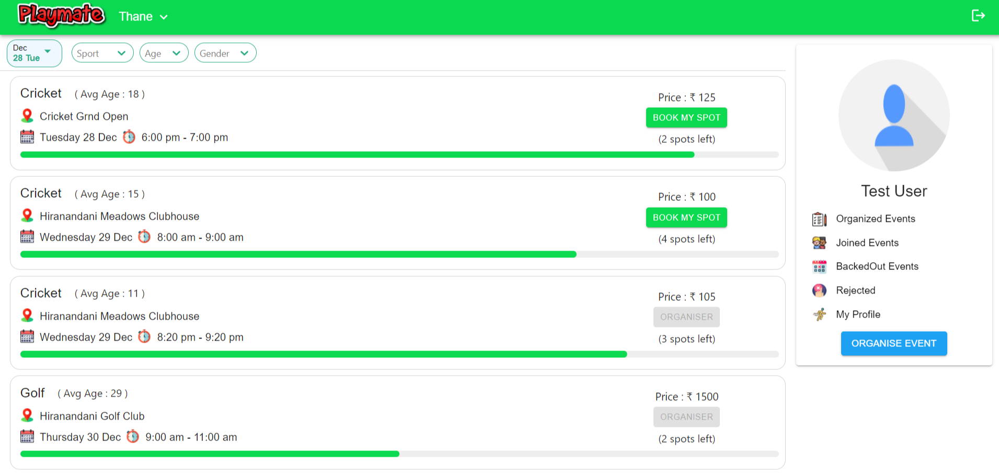
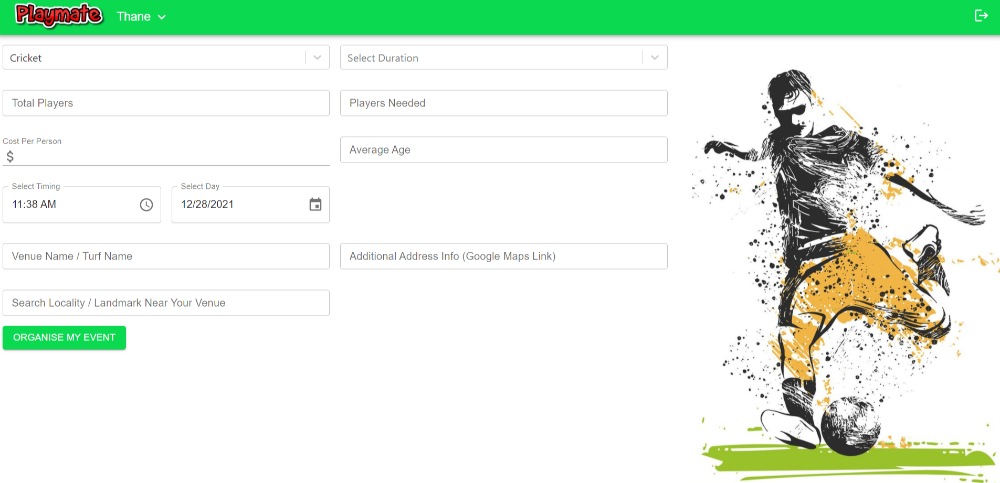
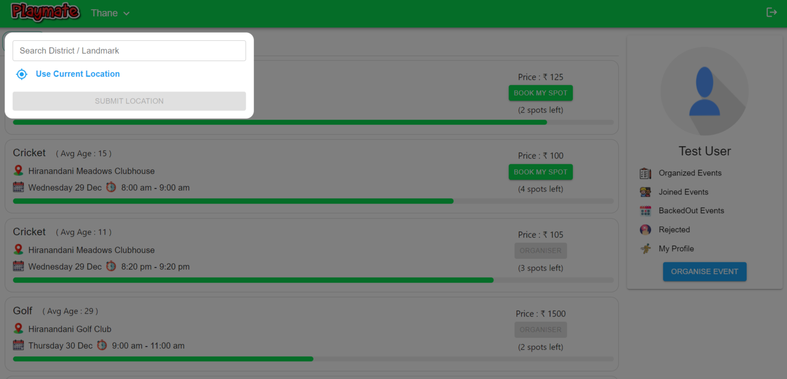
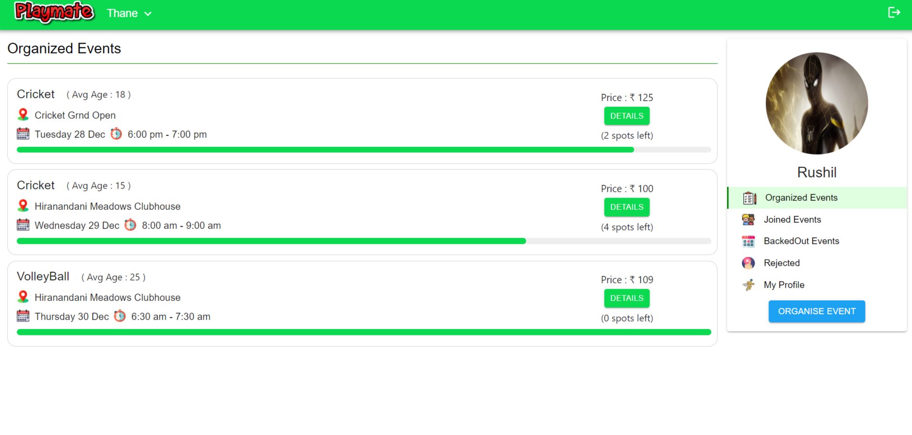
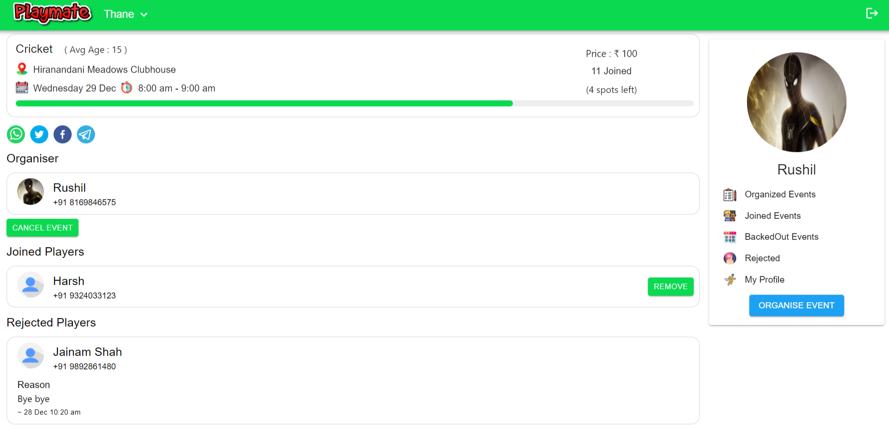
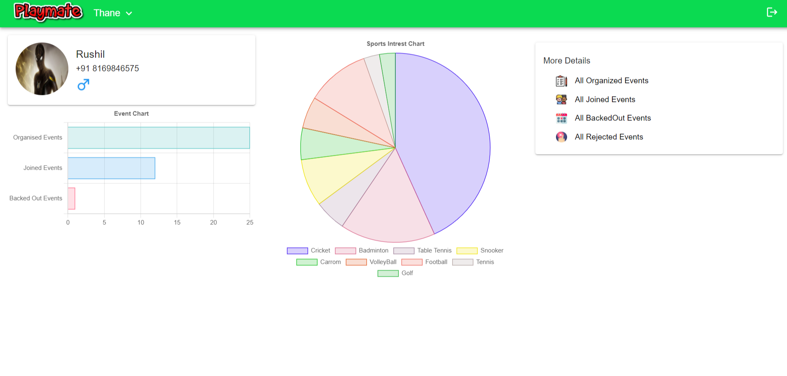

# Playmate
Find and Join sports event near you. Easily create and manage sports event. View your sports intrests and analysis.
#### You can view the project at https://playmate.vercel.app/

# Playmate Frontend

## Features
#### -> Create, Share and Manage Sports Event
#### -> Join Sport Events near you
#### -> Get Notifications 3,6 and 12 hours before your joined event as a remainder.
#### -> Analysis of your sports profile with different charts.

## Standout Features

#### -> Chartjs for charts
#### -> Firebase for Push Notification
#### -> Material UI For Responsiveness
#### -> Location data through Mapbox

## Technologies Used

## Frontend
#### -> React
#### -> Firebase

## Backend
#### -> Express
#### -> Firebase
#### -> Mongodb

## UI Pages

## Members
- 1911122 Rushil
- 1911075 Harsh

## College: KJSCE
## Course: MERN

## Playmate Backend Link: https://github.com/gadaharsh/playmate-backend
